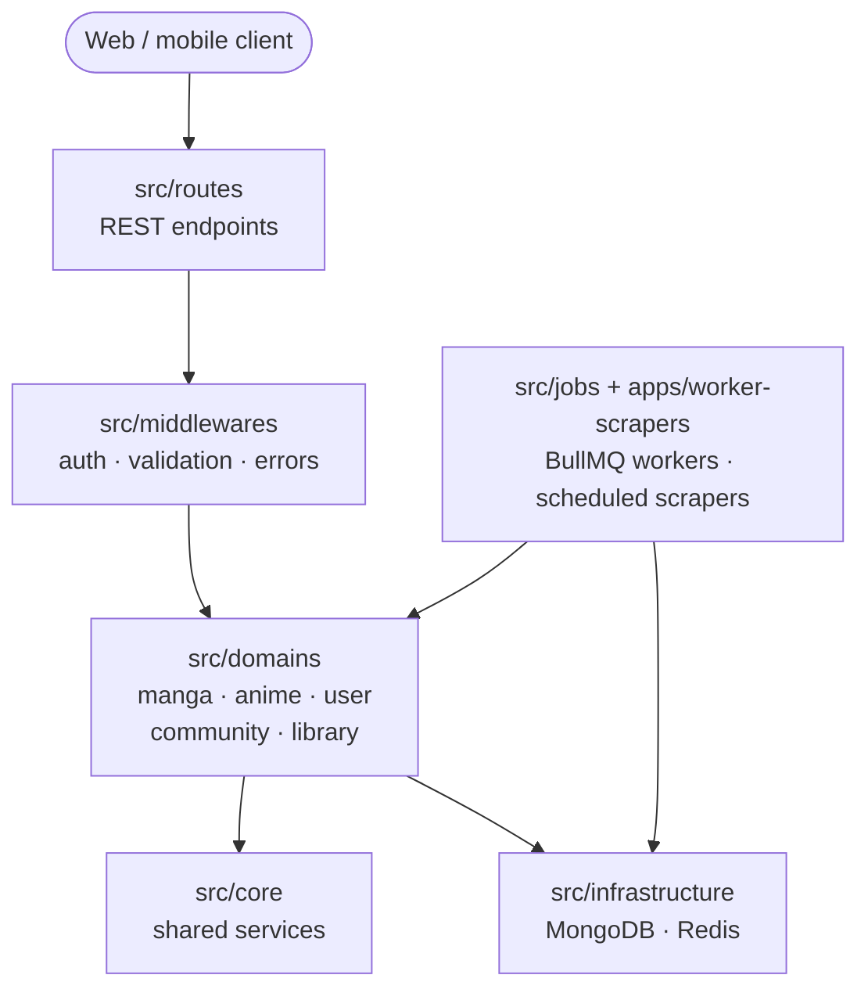

# AUDIRA-API-KOMIK — Comics & Anime Catalog API


A REST API backend for comics (manga, manhwa, manhua) and anime/donghua catalogs: content management, user accounts, community features, scheduled scrapers, and background jobs — organized in a domain-driven layout with tests and API documentation.

## About

Running a comics/anime content platform needs more than CRUD: metadata-rich catalogs, per-chapter tracking, user libraries, community interaction, and a steady intake of new content. This API provides the full backend for that — from JWT authentication to scheduled scraper workers — so clients (web or mobile) stay thin.

## Features

- **Catalog management** — manga/comics and anime/donghua with metadata (authors, artists, genres, studios, status)
- **Chapter & episode tracking** — per-chapter/per-episode records with media support
- **Authentication** — JWT access + refresh tokens, password reset
- **User library** — bookmarks with reading progress, history, custom collections
- **Community** — comments and reviews with ratings
- **Search & filtering** — full-text search, filtering by genre/status/author/rating, efficient pagination
- **Scraper pipeline** — pluggable web scrapers with scheduled sync jobs (`scripts/`, `apps/worker-scrapers`)
- **Caching & queues** — Redis caching, BullMQ background jobs
- **API docs** — Swagger/OpenAPI spec plus a Postman collection (`postman_collection.json`)
- **Tests** — Jest unit and integration suites (`tests/`)

## Tech Stack

| Concern | Technology |
|---|---|
| Runtime / framework | Node.js 16+, Express 4 |
| Database | MongoDB |
| Cache & queues | Redis, BullMQ |
| Auth | JWT (bcrypt-hashed passwords) |
| Scraping | Axios, Cheerio |
| Docs | Swagger, Postman |
| Tests | Jest |

## Architecture



## Getting Started

### Prerequisites

- Node.js 16+ (LTS recommended)
- MongoDB (local or Atlas)
- Redis (caching & job queue)

### Installation

```bash
git clone https://github.com/Audira141415/AUDIRA-API-KOMIK.git
cd AUDIRA-API-KOMIK
npm install
cp .env.example .env   # set MONGODB_URI, REDIS_URL, JWT_SECRET, ...
npm run dev            # http://localhost:3000
```

Useful scripts:

```bash
npm run worker        # start the BullMQ worker
npm run scheduler     # start scheduled sync jobs
npm test              # Jest unit + integration tests
npm run seed          # seed development data
```

See `.env.example` for the full list of environment variables.

## Project Structure

```text
src/
  app.js server.js        # Express setup & entry point
  routes/                 # REST endpoints
  middlewares/            # Auth, validation, error handling
  domains/                # Business domains (manga, anime, user, ...)
  core/                   # Shared services
  infrastructure/         # DB & cache connections
  jobs/                   # BullMQ job definitions
apps/worker-scrapers/     # Scraper workers
client/                   # API client helpers
scripts/                  # Import / scrape / seed utilities
tests/                    # Jest suites
docs/                     # Additional documentation
postman_collection.json   # Ready-to-import API collection
docker-compose.yml        # MongoDB + Redis + API
```

## API Documentation

A Swagger/OpenAPI spec is served by the app (see `src/config/swagger.js`), and `postman_collection.json` can be imported directly into Postman.

## Screenshots / Demo

> API response samples and a hosted demo link will be added here. For now, import `postman_collection.json` to explore the endpoints locally.

## License

Proprietary commercial software. See [LICENSE](LICENSE).

## Author

**Agus Dwi R** — Data Center Engineer, Batam, Indonesia.
